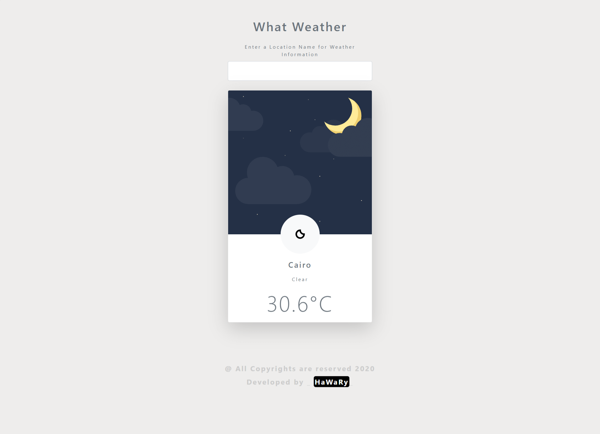

# What Weather

[](https://app.netlify.com/sites/whatweather14/deploys)  

What Weather is a forecasting weather App that allows you to get the weather conditions of a location you choose depending on the API of Accuweather website.

You can view the App from [here](https://whatweather14.netlify.app/)



## Demo

https://user-images.githubusercontent.com/69651552/214916210-2b36212d-90d5-4d49-9541-23ebdc2ab3f4.mp4

## Versions
  
* [v1](https://github.com/Mohamed-Elhawary/what-weather/tree/v1)  

* [v1.1](https://github.com/Mohamed-Elhawary/what-weather/tree/v1.1)  

  - Re-build the App with OOP JS technique, which increase from the App performance.

```
class Forecast {
    constructor() {
        this.myKey         = "98AOsgSnks0lZjHn5RiFy9JlXmTnDRbe";
        this.cityUrl       = "https://dataservice.accuweather.com/locations/v1/cities/search";
        this.weatherUrl    = `https://dataservice.accuweather.com/currentconditions/v1/`;
    }
    async getDetails(cityName) {
        const cityDetails    = await this.getCity(cityName);  //get promise object
        const weatherDetails = await this.getWeather(cityDetails.Key);  //get promis object
        return {cityDetails, weatherDetails}; //this is shorthand code for objects and it is equal to >>  return {cityDetails: cityDetails, weatherDetails:weatherDetails}
    }
    async getCity(city) {
        const queryParams = `?apikey=${this.myKey}&q=${city}`;
        const response    = await fetch( this.cityUrl + queryParams );
        const data        = await response.json();
        return data[0];
    }
    async getWeather(cityId) {
        const queryParams =  `${cityId}?apikey=${this.myKey}`;
        const response    = await fetch( this.weatherUrl + queryParams);
        const data        = await response.json();
        return data[0];
    }
}
```  

## Built With

* HTML5
* CSS3
* Vanilla JS

## Frameworks

* [Bootstrap](https://getbootstrap.com/)

## API  

* [Accuweather](https://accuweather.com)

## Author

* [Mohamed Elhawary](https://www.linkedin.com/in/mohamed-elhawary14/) 

## Contact me through my social accounts

* Email: mohamed.k.elhawary@gmail.com
* [LinkedIn](https://www.linkedin.com/in/mohamed-elhawary14/)
* [Github](https://github.com/Mohamed-Elhawary)  
* [Behance](https://www.behance.net/mohamed-elhawary14)
* [Codepen](https://codepen.io/Mohamed-ElHawary) 

## License

Licensed under the [MIT License](LICENSE)


